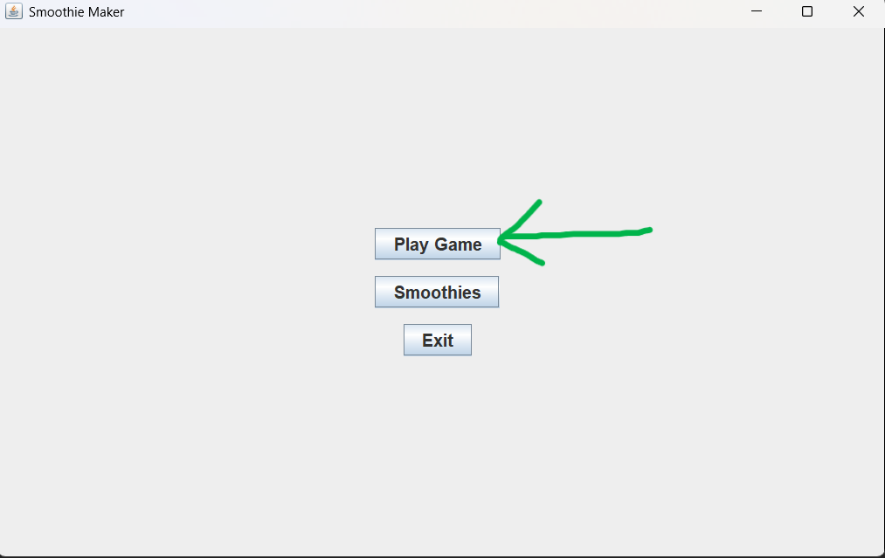

# Smoothie Maker

A Java Swing application that lets users create and customize their own smoothies with various ingredients, flavors, and toppings.

## Project Overview

Smoothie Maker is an interactive Simulation application where users can:
- Select different ingredients (fruits, flavors, toppings)
- Choose between different mug types
- Create and blend custom smoothies
- Track smoothies' health-scores based on ingredient combinations
- Get aliases for each ingredients
- View smoothie creation history of all players & their smoothies

## SOLID Principles Analysis ---->

### Well-Implemented SOLID Principles

1. **Single Responsibility Principle (SRP)**
   - `ScoreService`     : Handles only scoring logic
   - `MugFactory`       : Focused solely on mug creation
   - `StatusLogger`     : Dedicated to logging functionality
   - `GameStateManager` : Manages game state transitions
   - `MainFrame`        : Handles navigation and window management
   - `SmoothieLogger`   : Logs smoothie creation history
   - `LogViewer`        : Handles the display and loading of smoothie logs


2. **Open/Closed Principle (OCP)**
   - `Ingredient` hierarchy: Base abstract class with specific   
                             implementations (FruitIngredient, FlavorIngredient, ToppingIngredient)

   - New ingredient types can be added without modifying existing code


3. **Liskov Substitution Principle (LSP)**
   - `Ingredient` hierarchy : Subclasses (FruitIngredient, FlavorIngredient, ToppingIngredient)
                             can be substituted for their base class.

4. **Interface Segregation Principle (ISP)**
   - `Mug`        interface : Simple and focused with only essential methods
   - `Ingredient` Interface : Focused and small, providing only necessary methods for ingredients

5. **Dependency Inversion Principle (DIP)**
   - Components depend on abstractions (`Mug` interface, `Ingredient` abstract class)
   - `MugFactory` creates specific mug implementations through the `Mug` interface


### Areas for SOLID Improvement

1. **Single Responsibility Principle**
   - `GamePanel`: Currently handles multiple responsibilities (UI, game state)
   - This could be refactored into separate components

2. **Open/Closed Principle**
   - `ScoreService`: Hard-coded scoring logic could be more extensible
   - `BlenderController`: Blending logic could be more modular

3. **Liskov Substitution Principle**
   - Current implementation generally follows LSP well
   - No significant violations observed

4. **Interface Segregation Principle**
   - Current implementation generally follows ISP well
   - No violations observed

5. **Dependency Inversion Principle**
   - Can be Considered creating interfaces for blending strategies and score calculation methods to allow for more flexible and interchangeable implementations.


## Project Structure

```
src/
├── UI Components
│   ├── MainFrame.java             # Main application window
│   ├── GameFrame.java             # Game container frame
│   ├── GamePanel.java             # Main game interface
│   ├── NavigationPanel.java       # Navigation controls
│   ├── BlendControlPanel.java     # Blending controls UI
│   ├── BlenderAnimationPanel.java # Blending animation
│   ├── IngredientPanel.java       # Ingredient selection UI
│   ├── MugSelectionPanel.java     # Mug selection interface
│   ├── StatusPanel.java           # Status display panel
│   └── SmoothieLogViewer.java     # History viewer
│
├── Controllers
│   ├── BlenderController.java   # Blending logic controller
│   └── GameStateManager.java    # Game state management
│
├── Services
│   ├── AliasService.java        # Ingredient alias handling
│   ├── ScoreService.java        # Score calculation
│   └── StatusLogger.java        # Status logging service
│
├── Models
│   ├── Ingredient.java          # Base ingredient class
│   ├── FlavorIngredient.java    # Flavor type ingredients
│   ├── FruitIngredient.java     # Fruit type ingredients
│   └── ToppingIngredient.java   # Topping type ingredients
│
└── Mug System
    ├── Mug.java                 # Mug interface
    ├── MugFactory.java          # Mug creation factory
    ├── GlassMug.java            # Glass mug implementation
    └── PlasticMug.java          # Plastic mug implementation
```

## Getting Started

1. Clone the repository
2. Open the project in your preferred Java IDE
3. Run `Main.java` to start the application

## Usage
1. Start the application and select 'Play Game' to go to the game window
   
   

2. Select your preferred ingredients and mug type
3. Blend your ingredients to create a smoothie

   
   

4. Get back to 'Main Menu' to track your smoothie
   

5. View your smoothie creation history from the 'Main Menu'
   